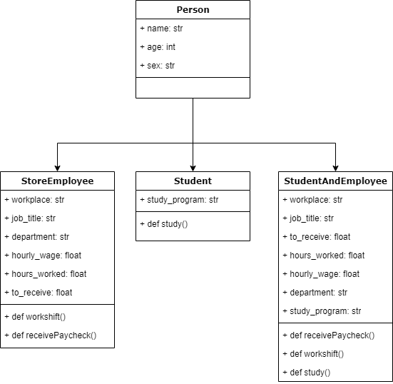

# Assignment 3 - Object-Oriented Analysis, Design, and Programming

## Problem 1: Object-Oriented Design
I have decided to program myself in two different contexts. One of them is as an employee at a store, the other is as a BA-student. In addition to that, a third class is present which is a mix of the two, so as to make a combination possible, but avoiding multiple inheritance while doing so.



The StoreEmployee class has variables such as workplace, job title, department, etc. and functions for working a shift and receiving a paycgeck, while the Student class has a study program variable and a study function. The StudentAndEmployee class is simply a combination of the two classes. 

## Problem 2: Object-Oriented Programming
### Person
Firstly a Person class is created and initialized with the variables 'name', 'age', and 'sex'.
```python
class Person:
    def __init__(self, name, age=None, sex=None):
        self.name = name
        self.age = age
        self.sex = sex
```

### **StoreEmployee**
Then, the StoreEmployee class is created and initialized based on the Person class. It has the variables mentioned in the first part and which can be seen on the diagram above.
```python
class StoreEmployee(Person):
    def __init__(self, workplace, job_title, department, hourly_wage, **kwarp):
        super(StoreEmployee, self).__init__(**kwarp)
        self.workplace = workplace
        self.job_title = job_title
        self.department = department
        self.hourly_wage = hourly_wage
        self.hours_worked = 0
        self.to_receive = 0
    
    def workShift(self, duration):
        self.hours_worked = self.hours_worked + duration
        print(f'{self.name} worked a {duration} hour shift')
        
    def receivePaycheck(self):
        self.to_receive = self.hours_worked * self.hourly_wage
        print(f'{self.name} is to get paid {self.to_receive} DKK for {self.hours_worked} hours of work')

```
**workShift()**

The workShift() function ads the number of hours passed as 'duration' to the hours_worked variable and prints out a statement to confirm that the object has worked for that amount of hours.

**receivePaycheck()**

The receivePaycheck() function defines the 'to_receive' variable by multiplying the 'hours_worked' variable by the 'hourly_wage' variable to get the amount that the object is to be paid.

### Student
Then, the Student class is created and inizialited based on the Peron class. The Student class has a 'study_program' variable
```python
class Student(Person):
    def __init__(self, study_program, **kwarp):
        super(Student, self).__init__(**kwarp)
        self.study_program = study_program
    
    def study(self, duration, intensity, course):
        print(f'{self.study_program}-student {self.name} has studied {intensity} for {duration} hours. He studied for the {course}-course')

```

**study()**

The study() function prints a statement confirming that the object has studied for a set amount of hours, with a set intensity, and for a set course.

## Problem 3: Instantiate Class using an Entry Point Function
Lastly, the StudentAndEmployee class is instantiaed and given the correct values for all the variables. Then, all of the functions are called to make the object work some shifts, receive a paycheck, and have a study-session

```python
def main():
    jhd = StudentAndEmployee(
        name='Jonas', 
        age=20, 
        sex='Male', 
        workplace='Bilka',
        job_title='Sales Assistant', 
        department='Home & Living', 
        hourly_wage=125,
        study_program="IVK English" 
        )

    print(f'{jhd.name} is a {jhd.age} year old {jhd.sex} who works as a {jhd.job_title} in the {jhd.department} department at {jhd.workplace}')
    jhd.workShift(6)
    jhd.workShift(8)
    jhd.workShift(5)
    jhd.receivePaycheck()
    jhd.study(2, "intensely", "Pfth22")

if __name__ == '__main__':
    main()
```